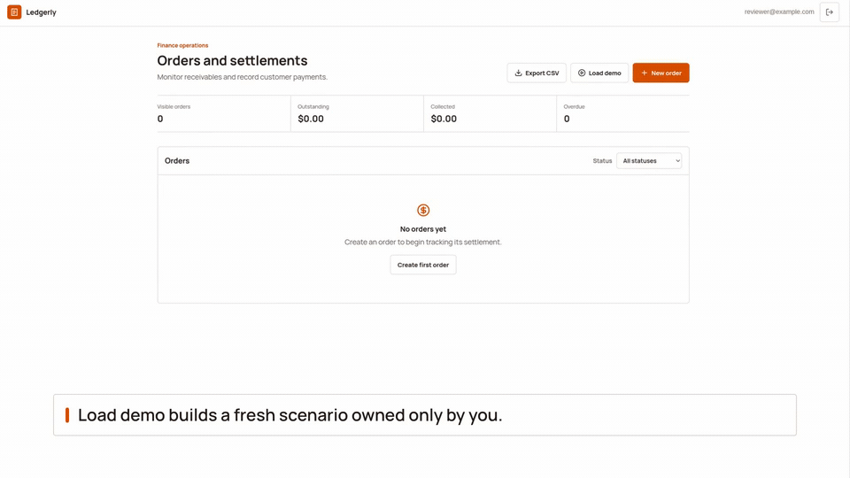
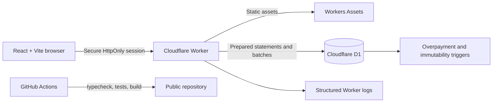
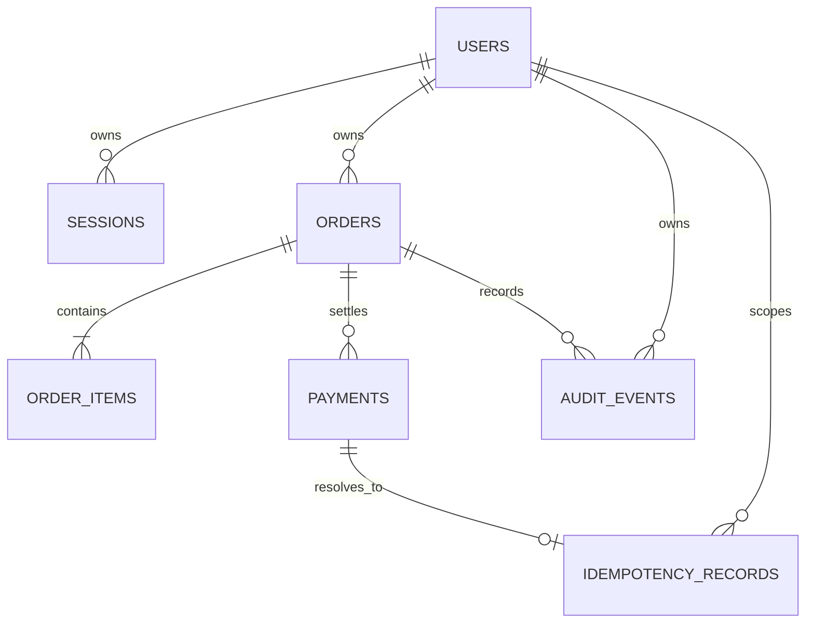
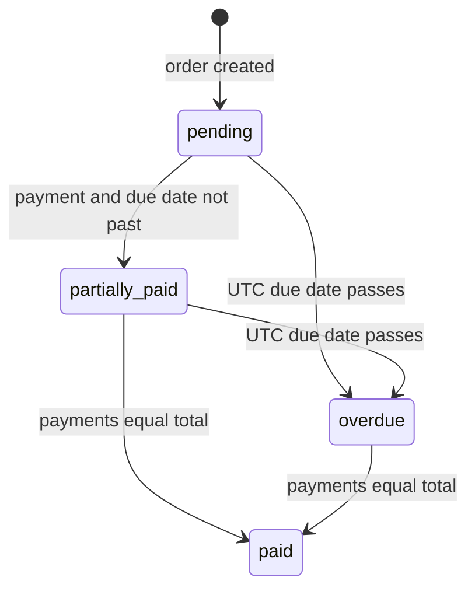

# Orders and Settlements

[](https://github.com/Achievengine/crossval-orders-settlements/actions/workflows/ci.yml)

**Live application:** https://crossval.inseat.co

**Fallback URL:** https://crossval-orders-settlements.abenuteshome.workers.dev

**Repository:** https://github.com/Achievengine/crossval-orders-settlements

A multi-tenant finance operations application for creating orders, recording partial settlements, and protecting financial history under retries and concurrent writes.

[](https://crossval.inseat.co)

## 90-second reviewer path

1. Sign up with any email and an eight-character password.
2. Select **Load demo**. This creates a fresh order owned only by the current user: `2 × $500 = $1,000`, with a `$400` first payment.
3. Confirm `partially_paid`, `$400` paid, and `$600` due.
4. Select **Pay remaining balance**, then **Record payment**.
5. Confirm `paid`, `$0` due, payment references, and the immutable audit timeline.
6. Attempt another `$1`; the API returns the latest maximum allowed amount of `$0.00`.

Every use of **Load demo** creates a new uniquely identified scenario. There is no shared demo account or cross-user seed data.

## Why this assignment

Orders and settlements is close to real B2B SaaS and finance operations work: tenant isolation, immutable financial history, partial payments, derived state, retry safety, database invariants, REST APIs, and an operational dashboard. It also maps directly to CrossVal's emphasis on reconciliation, auditability, correctness, and end-to-end production ownership.

## Five engineering guarantees

1. **Server-owned money:** clients send quantities and integer-cent unit prices; the Worker calculates every line and order total.
2. **Tenant isolation:** every order, payment, audit, demo, and export query is scoped by the authenticated `user_id`; cross-user IDs return `404`.
3. **Concurrent overpayment protection:** a D1 `BEFORE INSERT` trigger rejects any payment that would take the aggregate above the order total.
4. **Idempotent payment writes:** retries with the same key and payload replay the original result; changing the payload returns `409 IDEMPOTENCY_KEY_REUSED`.
5. **Immutable history:** orders lock after their first payment, and append-only audit events cannot be updated or deleted at the database layer.

## Architecture



One Worker serves the SPA and REST API. All requests pass through the Worker so CSP, HSTS, frame protection, referrer policy, permissions policy, and request IDs cover both HTML and API responses. D1 stores isolated assignment data only; no INSEAT infrastructure is used.

## Database schema



Session tokens and idempotency keys are stored only as hashes. Passwords use random salts and PBKDF2 hashes.

## Status and payment state machine



Paid takes precedence over overdue. A date-only due date is overdue only after that UTC calendar date passes.

## API endpoints

| Method | Endpoint | Purpose |
| --- | --- | --- |
| `GET` | `/api/health` | D1 health and application version |
| `POST` | `/api/auth/signup` | Atomic account and session creation |
| `POST` | `/api/auth/login` | Authenticate and issue session |
| `POST` | `/api/auth/logout` | Revoke current session |
| `GET` | `/api/orders?status=` | Owner-scoped dashboard |
| `GET` | `/api/orders.csv` | Owner-scoped formula-safe CSV |
| `POST` | `/api/orders` | Atomic order, items, and audit event |
| `GET` | `/api/orders/:orderId` | Detail, payments, and audit timeline |
| `PUT/DELETE` | `/api/orders/:orderId` | Mutate or soft-delete an unpaid order only |
| `POST` | `/api/orders/:orderId/payments` | Idempotent payment |
| `POST` | `/api/demo` | Fresh owner-only canonical scenario |

## Error envelope

```json
{
	"error": {
		"code": "OVERPAYMENT",
		"message": "Payment exceeds the remaining balance.",
		"field": "amount",
		"max_allowed_cents": 60000,
		"request_id": "req_...",
		"retryable": false
	}
}
```

| Status | Meaning |
| --- | --- |
| `400` | Invalid JSON or idempotency key |
| `401` | Missing or expired session |
| `403` | Cross-origin write |
| `404` | Unknown or non-owned resource |
| `409` | Overpayment, lock, or idempotency conflict |
| `413/415` | Body or content-type rejection |
| `422` | Field-level validation details |
| `429` | D1-backed limit plus `Retry-After` |
| `500` | Sanitized internal failure |

`X-Request-Id` matches the error-body request ID. SQL messages, traces, credentials, and internal identifiers are not exposed.

## Idempotency contract

Payment creation requires an opaque `Idempotency-Key` header.

- The key is hashed and uniquely scoped by user plus operation.
- A canonical payload hash covers order, amount, payment date, and note.
- Same key and payload replays the stored `201` result with `Idempotency-Replayed: true`.
- Same key and different payload returns `409 IDEMPOTENCY_KEY_REUSED`.
- Payment and idempotency reservation commit in one D1 batch, so same-key races create one payment.
- Assignment records persist for the database lifetime; production would expire them after a documented replay horizon.

Idempotency and the overpayment trigger solve different failures. Duplicate `$400` requests both fit a `$1,000` balance, so only idempotency prevents duplication. Different `$600` keys racing against a `$600` balance are instead arbitrated by the trigger.

## Concurrency invariant

```text
SUM(existing payments) + NEW.amount_cents <= order.total_cents
```

The early balance read exists for useful feedback, but correctness rests on `payments_prevent_overpayment`, a D1 `BEFORE INSERT` trigger. On conflict, the Worker re-reads the latest balance and returns the current maximum.

The assignment rejects overpayment as a hard invariant. A production accounting platform might model customer credits, refunds, or credit notes. Those need additional accounting semantics and were deliberately excluded.

## Tenant isolation and security

- Registration includes a live strength meter backed by the same shared 8–128 character policy used by the API; length and character-mix recommendations are announced accessibly.
- Random session cookies are `HttpOnly`, `Secure`, and `SameSite=Strict`; only token hashes reach D1.
- Every resource, audit, export, and demo query uses authenticated ownership.
- Cross-user IDs return `404` to avoid existence disclosure.
- Same-origin writes are checked with `Origin` and `Sec-Fetch-Site`.
- JSON bodies are limited to 32 KiB and validated with Zod caps.
- Signup/login and payment writes use durable D1 rate-limit counters, not an in-memory map.
- CSP, HSTS, `nosniff`, frame, referrer, and permissions policies cover the SPA and API.
- CSV values beginning with `=`, `+`, `-`, or `@` are neutralized.

## Indexes and query patterns

| Index or constraint | Query served |
| --- | --- |
| Unique normalized `users.email` | Signup conflict and login |
| Primary `sessions.id_hash` | Hashed session lookup |
| `sessions.expires_at` | Session cleanup |
| `orders(user_id, created_at DESC)` | Newest-first owner dashboard |
| `orders(user_id, due_date)` | Owner due-date scans |
| `orders(user_id, deleted_at, created_at DESC)` | Active-order dashboard after soft deletion |
| `payments(order_id, payment_date DESC)` | Balance and payment timeline |
| `audit_events(user_id, order_id, created_at)` | Owner audit timeline |
| `(user_id, operation, key_hash)` primary key | Idempotency reservation |
| `idempotency_records.created_at` | Retention cleanup |
| `(scope_hash, action, window_started_at)` primary key | Rate-limit counter |

## Test inventory

```bash
npm ci
npm run cf-typegen
npm run typecheck
npm test
npm run build
npx wrangler deploy --dry-run
```

Current result: **19 tests across 2 files** covering canonical settlement, money math, status and UTC boundaries, authentication and tenant isolation, order locking, concurrent overpayment, idempotent replay/mismatch/races/user scope, immutable audits, soft deletion with retained history, request IDs, security controls, rate limiting, isolated demos, and safe owner-only CSV.

GitHub Actions runs install, Wrangler type generation, typecheck, tests, and build on pushes and pull requests.

## Local setup

```bash
cp .env.example .env
npm install
npm run cf-typegen
npm run db:migrate:local
npm run build
npm run dev:worker
```

No local secrets are required. Open `http://localhost:8787`.

## Deployment and cleanup

```bash
npx wrangler d1 create crossval-orders-settlements-db
npm run db:migrate:remote
npm run deploy
```

```bash
npx wrangler delete crossval-orders-settlements
npx wrangler d1 delete crossval-orders-settlements-db
```

## CrossVal production mapping

| Assignment | CrossVal-style production mapping |
| --- | --- |
| D1 trigger | MongoDB transaction and invariant validation |
| D1 idempotency table | Unique MongoDB idempotency index |
| Audit events | Append-only audit collection or stream |
| Worker logs | Structured AWS logs and CloudWatch alarms |
| D1 migrations | Versioned production migration process |
| Worker deployment | CI/CD-controlled AWS deployment |
| D1 rate limits | Managed edge limiter or Redis/DynamoDB |

In MongoDB, payment insertion, invariant validation, idempotency reservation, and event append would run in one transaction with unique indexes. Alerts would cover invariant failures, elevated `409/429/500` rates, latency, and reconciliation discrepancies.

## Assumptions and production improvements

- USD only; production needs ISO currency semantics.
- UTC date-only due dates; production needs account timezone and business-day policy.
- Assignment-scale unpaginated lists; production needs cursor pagination and indexed date/search filters.
- D1 rate counters are durable and honest for this workload, but a managed edge limiter is better at scale.
- Audit history persists; idempotency records need a documented production retention job.
- Unpaid order deletion is a soft delete so immutable audit history and referential integrity remain intact.
- Production financial corrections use reversal events, not edits.
- Managed identity, MFA, roles, refunds, credits, provider webhooks, backups, recovery drills, alerts, SLOs, and reconciliation workflows remain production extensions.

## Real-world references

- **Stripe:** idempotent retries, amount remaining, payment history, and machine-readable errors.
- **Modern Treasury:** immutable who/what/when event history.
- **CrossVal:** reconciliation, auditability, financial correctness, and operator clarity.

Stripe may model an overpayment as customer credit; this assignment rejects it because credit and refund semantics are outside scope.

## AI-tool usage disclosure

GitHub Copilot assisted with implementation, tests, documentation, and browser validation. Business rules were translated into database constraints and executable tests. Changes were typechecked, tested in the Workers runtime, built, dry-run deployed, exercised locally and live, and inspected with Chrome DevTools before publication.